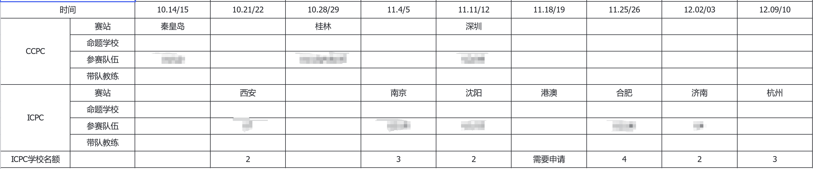

# 比赛

按照队伍实力递减的顺序，每支队伍在赛季初获得4场至1场不等的**区域赛**名额。在区域赛取得优秀成绩的队伍将获得参加**ICPC EC final, CCPC final**乃至**ICPC final**的名额。

比赛一般在周末，其中周六是热身赛，用来适应赛场环境和机器，周日是正式比赛。

比赛地点在中国各地。当周周末有比赛的同学一般周五或周六从上海出发前往比赛场地，周日或下周周一启程返回上海。

<figure><figcaption>
<strong>2023赛季所有所有区域赛分赛站</strong>
</figcaption></figure>

